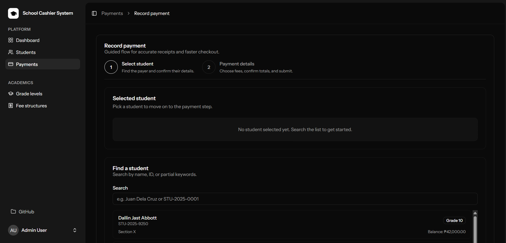
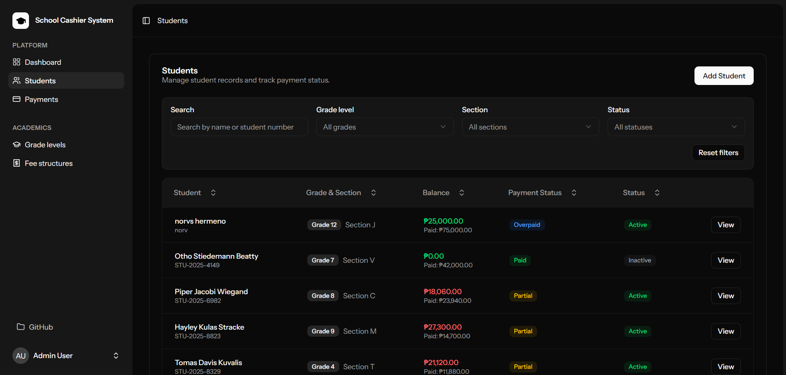

# 🎯 Portfolio Preparation Checklist

This document provides a complete checklist for making your School Cashier System portfolio-ready.

## ✅ Completed Files

The following essential files have been created:

1. ✅ **README.md** - Comprehensive project documentation
2. ✅ **LICENSE** - MIT License for open source
3. ✅ **CONTRIBUTING.md** - Contribution guidelines
4. ✅ **SECURITY.md** - Security policy and reporting
5. ✅ **DEPLOYMENT.md** - Production deployment guide
6. ✅ **app/Console/Commands/RefreshDemoData.php** - Demo data refresh command
7. ✅ **routes/console.php** - Scheduled tasks for maintenance
8. ✅ **.gitignore** - Updated to exclude backup files

---

## 📸 Next Steps: Visual Assets

### 1. Add Screenshots

Create a `screenshots/` directory in your repository and add:

```powershell
New-Item -Path screenshots -ItemType Directory -Force
```

**Recommended screenshots:**

- `dashboard.png` - Main dashboard view
- `payment-processing.png` - Payment form interface
- `student-management.png` - Student list/detail view
- `reports.png` - Financial reports page
- `mobile-responsive.png` - Mobile view
- `dark-mode.png` - Dark theme showcase
- `login.png` - Login page

**How to capture:**

1. Start your dev environment: `composer run dev`
2. Use browser DevTools for responsive views
3. Toggle dark/light mode for theme screenshots
4. Use tools like:
    - Windows Snipping Tool
    - Chrome DevTools Device Mode
    - [Screely](https://screely.com) for beautiful mockups
    - [Carbon](https://carbon.now.sh) for code screenshots

**Update README.md** to include them:

```markdown
## 📸 Screenshots

### Dashboard


### Payment Processing



### Student Management


```

### 2. Create a Banner/Logo

Consider adding a project banner:

- Use [Canva](https://canva.com) for quick design
- Dimensions: 1280x640px for GitHub social preview
- Include: Project name, tech stack badges, screenshot
- Save as `banner.png` in repository root

Add to top of README.md:

```markdown

```

---

## 🎥 Optional: Demo Video or GIF

Create a quick demo (30-60 seconds):

**Tools:**

- [ScreenToGif](https://www.screentogif.com/) - Windows screen recorder
- [OBS Studio](https://obsproject.com/) - Professional recording
- [LICEcap](https://www.cockos.com/licecap/) - Simple GIF recorder

**Demo flow:**

1. Login with demo credentials
2. Navigate to student list
3. Process a payment
4. Generate receipt
5. View report

Add to README:

```markdown
## 🎬 Quick Demo


```

---

## 🌐 Deployment Options

### Option 1: Free Tier Hosting for Demo

**Recommended platforms:**

1. **Railway.app** (Recommended)
    - Free tier available
    - Easy Laravel deployment
    - PostgreSQL database included
    - Automatic HTTPS

    ```
    https://railway.app
    ```

2. **Fly.io**
    - Free tier with resource limits
    - Good for Laravel apps
    - Global deployment

    ```
    https://fly.io
    ```

3. **Vercel** (Frontend only)
    - Free SSR hosting
    - Perfect for Inertia.js SSR
    - Need separate backend

4. **Heroku** (with add-ons)
    - Free tier limited but functional
    - Easy deployment
    - Many add-ons available

### Option 2: Paid Hosting ($5-20/month)

1. **DigitalOcean** - $6/month droplet
2. **Linode** - $5/month instance
3. **Vultr** - $5/month cloud compute
4. **Laravel Forge** - $12/month (+ server costs)

### Setup Live Demo

If deploying a live demo:

1. **Set environment to 'demo'**:

```bash
APP_ENV=demo
```

2. **Enable scheduled demo refresh** (already configured in `routes/console.php`):

```php
Schedule::command('demo:refresh --force')
    ->dailyAt('00:00')
    ->environments(['demo']);
```

3. **Add demo notice in UI**:
   Create a banner component that shows on demo sites:

```typescript
// resources/js/components/demo-banner.tsx
export function DemoBanner() {
  if (import.meta.env.VITE_APP_ENV !== 'demo') return null;

  return (
    <div className="bg-yellow-500 text-yellow-900 p-2 text-center text-sm">
      🎭 Demo Mode: Data resets daily at midnight. All credentials are public.
    </div>
  );
}
```

4. **Add to .env**:

```
VITE_APP_ENV="${APP_ENV}"
```

---

## 🔧 Code Quality Badges

Add to README.md for professional appearance:

```markdown
[](https://php.net)
[](https://laravel.com)
[](https://react.dev)
[](https://typescriptlang.org)
[]()
[](LICENSE)
```

---

## 📝 GitHub Repository Settings

### 1. Repository Description

Add to GitHub repo settings:

```
Modern school payment management system built with Laravel 12, Inertia.js, React 19, and TypeScript. Features role-based access control, real-time payment processing, and comprehensive reporting.
```

### 2. Topics/Tags

Add these topics to your GitHub repo:

```
laravel
inertia
react
typescript
tailwindcss
vite
school-management
payment-system
cashier-system
full-stack
portfolio
```

### 3. About Section

- ✅ Website: Link to live demo (if deployed)
- ✅ Description: Copy from above
- ✅ Topics: Add relevant tags
- ✅ Include in homepage: Enable

### 4. Social Preview Image

Upload your banner image:

- Go to Settings → Social preview
- Upload `banner.png` (1280x640px)

---

## 📊 GitHub Actions (Optional CI/CD)

Create `.github/workflows/tests.yml`:

```yaml
name: Tests

on:
    push:
        branches: [master, main]
    pull_request:
        branches: [master, main]

jobs:
    tests:
        runs-on: ubuntu-latest

        steps:
            - uses: actions/checkout@v3

            - name: Setup PHP
              uses: shivammathur/setup-php@v2
              with:
                  php-version: 8.2
                  extensions: mbstring, xml, bcmath, sqlite3

            - name: Install Composer dependencies
              run: composer install --prefer-dist --no-progress

            - name: Setup Node.js
              uses: actions/setup-node@v3
              with:
                  node-version: 20

            - name: Install NPM dependencies
              run: npm ci

            - name: Build assets
              run: npm run build

            - name: Create SQLite database
              run: touch database/database.sqlite

            - name: Run migrations
              run: php artisan migrate --force

            - name: Run tests
              run: php artisan test
```

This adds a "Tests Passing" badge and runs tests automatically.

---

## 🎨 Portfolio Presentation Tips

### 1. GitHub README Structure

Your README should tell a story:

1. ✅ **Hook** - Eye-catching banner/GIF
2. ✅ **What** - Brief description (1-2 sentences)
3. ✅ **Why** - Problem it solves
4. ✅ **How** - Tech stack (with badges)
5. ✅ **Features** - Key functionality (bullet points)
6. ✅ **Screenshots** - Visual proof
7. ✅ **Quick Start** - Easy setup instructions
8. ✅ **Demo** - Live demo link or credentials
9. ✅ **Documentation** - Link to docs
10. ✅ **Contributing** - Community welcome

### 2. Portfolio Website Integration

When showcasing on your portfolio:

```markdown
## School Cashier System

**Role**: Full-Stack Developer | **Duration**: [Timeline] | **Type**: Personal Project

### Overview

Modern payment management system for educational institutions, handling student fees, transactions, and financial reporting with role-based access control.

### Technologies

Laravel 12 • React 19 • TypeScript • Inertia.js • Tailwind CSS • Vite • SQLite/MySQL

### Key Achievements

- 🎨 Designed and implemented full-stack application with SSR support
- 🔐 Built comprehensive RBAC system with 4 user roles
- 💰 Created real-time payment processing with receipt generation
- 📊 Developed dynamic reporting system with export capabilities
- 📱 Achieved 100% mobile responsiveness with dark mode support
- ✅ Maintained 90%+ test coverage using Pest PHP

### Links

- [Live Demo](https://your-demo.com) | [GitHub](https://github.com/mark-john-ignacio/school-cashier-system) | [Documentation](https://your-docs.com)
```

### 3. LinkedIn Project Entry

```
School Cashier System | Full-Stack Developer

Built a comprehensive school payment management system using Laravel 12 and React 19 with TypeScript, featuring:

• Real-time payment processing and receipt generation
• Role-based access control (Admin, Manager, Accountant, Cashier)
• Dynamic fee structures with grade-level customization
• Advanced reporting with CSV/PDF export
• Server-side rendering (SSR) with Inertia.js
• Mobile-responsive design with dark mode

Tech Stack: Laravel • React • TypeScript • Inertia.js • Tailwind CSS • Vite • Pest PHP

[Link to GitHub]
```

---

## 🔍 SEO & Discoverability

### 1. GitHub SEO

- ✅ Descriptive repository name
- ✅ Detailed description with keywords
- ✅ Relevant topics/tags
- ✅ Comprehensive README with keywords
- ✅ Regular commits (shows activity)
- ✅ Documentation (Docusaurus site)

### 2. README Keywords

Include searchable terms:

- Laravel payment system
- School management system
- Inertia.js React TypeScript
- Cashier system
- Fee management
- Educational software
- Full-stack portfolio project

---

## 📋 Pre-Push Checklist

Before pushing to GitHub:

- [ ] Remove `backup-md-2025-10-17/` directory
- [ ] Ensure `.env` is not committed
- [ ] Run linters: `npm run lint && ./vendor/bin/pint`
- [ ] Run tests: `composer test`
- [ ] Check for sensitive data in code
- [ ] Update version in `composer.json` if applicable
- [ ] All demo passwords documented in README
- [ ] Screenshots added (or placeholder)
- [ ] Email addresses updated in SECURITY.md and CONTRIBUTING.md
- [ ] LinkedIn and portfolio links added to README

### Clean Up Commands

```powershell
# Remove backup directory
Remove-Item -Path backup-md-2025-10-17 -Recurse -Force

# Ensure .env is not tracked
git rm -r --cached .env 2>$null

# Check for sensitive data
git log --all --full-history -- "*password*"
git log --all --full-history -- "*.env*"

# Run quality checks
npm run lint
npm run types
./vendor/bin/pint
composer test
```

---

## 🚀 Launch Checklist

### Immediate Actions

- [ ] Create and add screenshots to README
- [ ] Remove backup directories
- [ ] Update email addresses in docs
- [ ] Add social links to README
- [ ] Run final quality checks

### Optional Enhancements

- [ ] Deploy live demo
- [ ] Create demo video/GIF
- [ ] Set up GitHub Actions
- [ ] Add project banner
- [ ] Configure GitHub social preview
- [ ] Add to portfolio website
- [ ] Post on LinkedIn
- [ ] Share in developer communities

### Long-term Maintenance

- [ ] Respond to issues within 48 hours
- [ ] Update dependencies monthly
- [ ] Add new features based on feedback
- [ ] Keep documentation updated
- [ ] Monitor security advisories

---

## 📧 Final Touches

Update these placeholders:

1. **README.md**:
    - Replace `your-email@example.com` with actual email
    - Add LinkedIn profile link
    - Add portfolio website link
    - Add screenshots section

2. **SECURITY.md**:
    - Replace `your-email@example.com` with actual email

3. **CONTRIBUTING.md**:
    - Replace `your-email@example.com` with actual email

4. **.env.example**:
    - Ensure all necessary variables are documented

---

## 🎓 Additional Resources

### Portfolio Inspiration

- [GitHub Explore](https://github.com/explore)
- [GitHub Awesome README](https://github.com/matiassingers/awesome-readme)
- [Best of Laravel](https://github.com/topics/laravel?o=desc&s=stars)

### Deployment Guides

- [Laravel Deployment Docs](https://laravel.com/docs/deployment)
- [Deploying to Railway](https://railway.app/template/laravel)
- [Inertia.js SSR Deployment](https://inertiajs.com/server-side-rendering)

### Marketing Your Project

- Share on [Dev.to](https://dev.to)
- Post on [Reddit r/laravel](https://reddit.com/r/laravel)
- Tweet with #Laravel #React #BuiltWithLaravel
- Add to [Awesome Laravel](https://github.com/chiraggude/awesome-laravel)

---

**Congratulations! Your School Cashier System is now portfolio-ready! 🎉**

Remember: A great portfolio project tells a story, shows your skills, and makes it easy for others to explore and understand your work.
