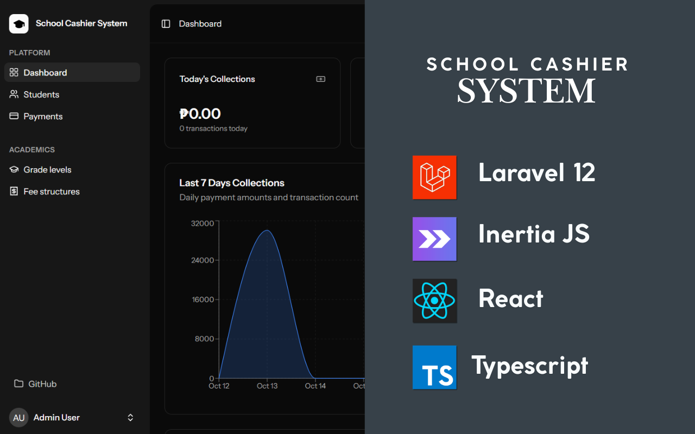

# 🏫 School Cashier System

A modern, full-featured school payment management system built with Laravel 12, Inertia.js, React 19, and TypeScript. Designed for efficient handling of student fee structures, payment processing, and financial reporting with role-based access control.

[](https://laravel.com)
[](https://react.dev)
[](https://www.typescriptlang.org)
[](https://inertiajs.com)
[](https://tailwindcss.com)

---

## ✨ Features

### 💰 Payment Management

- **Quick Payment Processing** - Streamlined interface for recording student payments
- **Payment History** - Comprehensive transaction logs with search and filtering
- **Receipt Generation** - Professional PDF receipts with school branding
- **Multiple Payment Methods** - Cash, check, online payment support

### 👥 Student Management

- **Student Database** - Complete student information with grade level and section assignment
- **Fee Assignment** - Flexible fee structure assignment per grade level
- **Balance Tracking** - Real-time outstanding balance calculations
- **Search & Filter** - Advanced search by name, student ID, grade, or section

### 💵 Fee Structure Management

- **Dynamic Fee Setup** - Create and manage various fee types (tuition, misc., etc.)
- **Grade-Based Pricing** - Different fee structures per grade level
- **Academic Year Management** - Organize fees by school year
- **Fee Templates** - Reusable fee structures for efficiency

### 📊 Reporting & Analytics

- **Financial Reports** - Daily, monthly, and custom date range reports
- **Collection Summary** - Track collection performance by cashier
- **Outstanding Reports** - Monitor unpaid balances by grade/section
- **Export Capabilities** - CSV/PDF export for accounting integration

### 🔐 Role-Based Access Control

- **Admin** - Full system access, user management, system settings
- **Manager** - View all reports, approve refunds, manage fee structures
- **Accountant** - Access financial reports, reconciliation tools
- **Cashier** - Process payments, generate receipts, view assigned students

### 🎨 Modern UI/UX

- **Responsive Design** - Works seamlessly on desktop, tablet, and mobile
- **Dark/Light Mode** - System and user-preference theme support
- **Accessibility** - WCAG compliant with keyboard navigation
- **Real-time Validation** - Instant form feedback for better UX

---

## 🛠️ Tech Stack

### Backend

- **Laravel 12** - Latest PHP framework with modern features
- **SQLite** - Lightweight database (easily switchable to MySQL/PostgreSQL)
- **Spatie Laravel Permission** - Robust role and permission management
- **Inertia.js Server** - Server-side rendering capabilities

### Frontend

- **React 19** - Latest React with modern features
- **TypeScript 5.7** - Type-safe development
- **Inertia.js** - SPA without API complexity
- **Vite 7** - Lightning-fast development and build tool
- **Tailwind CSS 4** - Utility-first styling with custom design system
- **Radix UI** - Accessible component primitives
- **shadcn/ui patterns** - Beautiful, reusable component patterns
- **TanStack Table** - Powerful data table management
- **Recharts** - Beautiful, responsive charts

### DevOps & Tooling

- **Laravel Wayfinder** - Type-safe routing with auto-generated helpers
- **Pest PHP** - Elegant testing framework
- **ESLint & Prettier** - Code quality and formatting
- **Docusaurus** - Comprehensive documentation site
- **Concurrently** - Multi-process development workflow

---

## 🚀 Quick Start

### Prerequisites

- PHP 8.2 or higher
- Composer 2.x
- Node.js 20.x or higher
- npm 10.x or higher

### Installation

1. **Clone the repository**

```powershell
git clone https://github.com/mark-john-ignacio/school-cashier-system.git
cd school-cashier-system
```

2. **Install PHP dependencies**

```powershell
composer install
```

3. **Install Node dependencies**

```powershell
npm install
```

4. **Set up environment**

```powershell
# Copy environment file
Copy-Item .env.example .env

# Generate application key
php artisan key:generate

# Create SQLite database
New-Item -Path database -Name database.sqlite -ItemType File -Force
```

5. **Run migrations and seed demo data**

```powershell
php artisan migrate --seed
```

6. **Start the development server**

```powershell
composer run dev
```

The application will be available at: **http://localhost:8000**

---

## 🎭 Demo Accounts

After seeding, you can log in with these accounts:

| Role           | Email                  | Password | Description           |
| -------------- | ---------------------- | -------- | --------------------- |
| **Admin**      | admin@school.test      | password | Full system access    |
| **Cashier**    | cashier@school.test    | password | Payment processing    |
| **Manager**    | manager@school.test    | password | Reports and oversight |
| **Accountant** | accountant@school.test | password | Financial reports     |

> **Note:** All demo accounts use `password` as the password. Change these in production!

---

## � Code Quality

This project emphasizes clean, maintainable code with comprehensive documentation:

### Type Safety

- **Typed Routes** - Auto-generated TypeScript helpers via Laravel Wayfinder
- **Strict TypeScript** - Full type coverage with no `any` types in business logic
- **Form Type Safety** - Strongly typed Inertia form helpers for all endpoints

### Documentation

- **PHPDoc Comments** - Comprehensive documentation for all models and controllers
- **JSDoc Comments** - Detailed component and function documentation
- **Inline Explanations** - Complex logic explained with inline comments
- **Usage Examples** - Code examples in documentation for common patterns

### Best Practices

- **Centralized Constants** - Shared values defined in typed constant files
- **DRY Principles** - Reusable components and utility functions
- **SOLID Principles** - Clean architecture with single responsibility
- **Consistent Naming** - Clear, self-documenting variable and function names

### Developer Experience

- **Comprehensive README** - Quick start, features, and deployment guides
- **Contributing Guidelines** - Clear standards for code contributions
- **Security Policy** - Vulnerability reporting and security best practices
- **Development Guide** - Architecture patterns and common workflows

---

## �📖 Documentation

Comprehensive documentation is available via Docusaurus:

```powershell
# Start documentation site
npm run docs:dev
```

Visit: **http://localhost:3000**

### Documentation Sections:

- 📐 **Architecture** - System design and patterns
- 💻 **Developer Guide** - Contributing and code standards
- 🔄 **Workflows** - Business process flows
- 🚧 **Implementation** - Project status and roadmap
- ✨ **Features** - Detailed feature documentation

---

## 🧪 Testing

```powershell
# Run test suite
composer test

# Run with coverage
composer test -- --coverage
```

---

## 🎨 Development Workflows

### Standard Development (CSR)

```powershell
composer run dev
```

Runs: PHP server + Queue worker + Vite dev server

### SSR Development

```powershell
composer run dev:ssr
```

Runs: PHP server + Queue worker + Vite SSR + Laravel Pail logs

### Code Quality

```powershell
# Lint JavaScript/TypeScript
npm run lint

# Format code
npm run format

# Check formatting
npm run format:check

# Type check
npm run types

# PHP formatting (Laravel Pint)
./vendor/bin/pint
```

### Building for Production

```powershell
# Build client-side assets
npm run build

# Build with SSR
npm run build:ssr
```

---

## 📁 Project Structure

```
school-cashier-system/
├── app/
│   ├── Http/Controllers/        # Request handlers
│   ├── Models/                  # Eloquent models
│   └── Providers/               # Service providers
├── database/
│   ├── factories/               # Model factories
│   ├── migrations/              # Database schema
│   └── seeders/                 # Data seeders
├── docs/                        # Docusaurus documentation
├── resources/
│   ├── js/
│   │   ├── actions/            # Auto-generated controller actions
│   │   ├── components/         # React components
│   │   ├── hooks/              # Custom React hooks
│   │   ├── layouts/            # Page layouts
│   │   ├── pages/              # Inertia pages
│   │   └── routes/             # Auto-generated route helpers
│   └── views/                  # Blade templates
├── routes/
│   ├── auth.php                # Authentication routes
│   ├── settings.php            # Settings routes
│   └── web.php                 # Main routes
└── tests/                      # Pest tests
```

---

## 🤝 Contributing

Contributions are welcome! Please read [CONTRIBUTING.md](CONTRIBUTING.md) for details on the code of conduct and submission process.

### Development Guidelines:

1. Follow Laravel and React best practices
2. Write tests for new features
3. Ensure TypeScript types are properly defined
4. Run linters before committing
5. Update documentation for significant changes

---

## 📝 License

This project is licensed under the MIT License - see the [LICENSE](LICENSE) file for details.

---

## 🔒 Security

If you discover any security-related issues, please email **your-email@example.com** instead of using the issue tracker. See [SECURITY.md](SECURITY.md) for more details.

---

## 📬 Contact

**Mark John Ignacio**

- GitHub: [@mark-john-ignacio](https://github.com/mark-john-ignacio)
- LinkedIn: [mark-john-ignacio](https://www.linkedin.com/in/mark-john-ignacio/)
- Portfolio: [https://markjohnignacio.tech/](https://markjohnignacio.tech/)

---

## 🙏 Acknowledgments

- Built with [Laravel](https://laravel.com)
- Powered by [Inertia.js](https://inertiajs.com)
- UI components inspired by [shadcn/ui](https://ui.shadcn.com)
- Icons by [Lucide](https://lucide.dev)

---

## 📸 Screenshots

### Dashboard


### Payment Processing


### Student Management


---

## 🗺️ Roadmap

- [ ] Multi-currency support
- [ ] SMS notifications for payments
- [ ] Online payment gateway integration
- [ ] Mobile app (React Native)
- [ ] Barcode/QR code student ID scanning
- [ ] Automated report scheduling
- [ ] Advanced analytics dashboard

---

<div align="center">
Made with ❤️ for educational institutions
</div>
